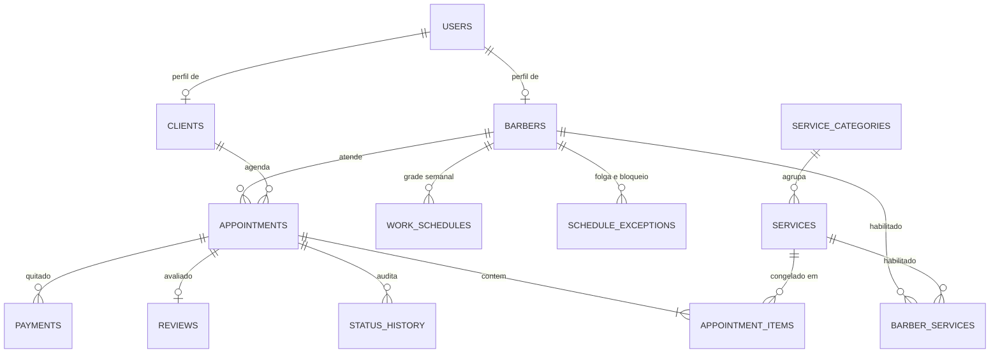
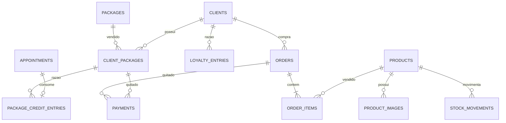
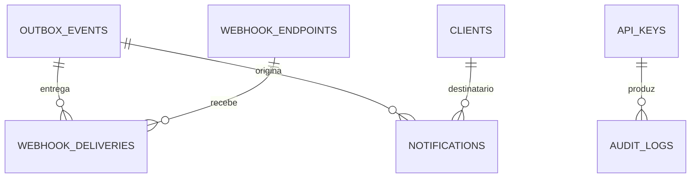
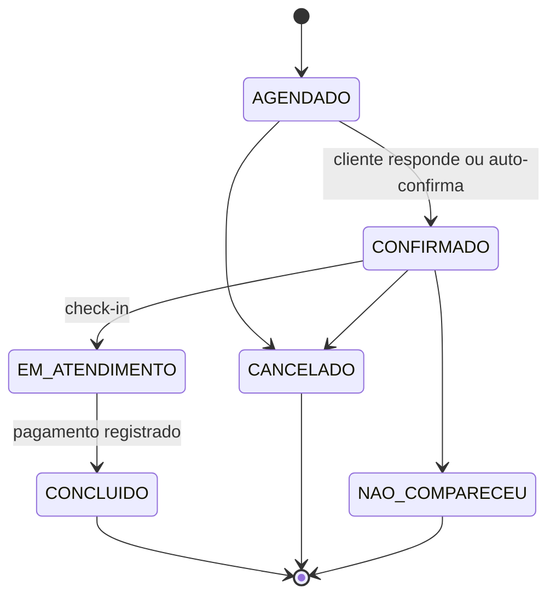

# Projeto Prisma — Arquitetura do Sistema de Barbearia

Modelagem de dados, contrato de API e a mecânica de concorrência que impede dois clientes
de ocuparem a mesma cadeira no mesmo minuto.

**Stack:** PostgreSQL 14+ · Prisma + TypeScript · API-first (REST) · Webhooks para n8n
**Data:** 14/08/2026

---

## 00 · Premissas

- **PostgreSQL não é intercambiável aqui.** A garantia anti-*double booking* da seção 03
  usa `EXCLUDE USING gist` sobre `tstzrange`, que só existe no Postgres. Em MySQL a mesma
  garantia exigiria travar linhas manualmente — funciona, mas com mais código e mais
  chance de erro.
- **Uma unidade, schema multi-unidade.** Toda tabela operacional carrega `shop_id` desde o
  dia 1, mesmo com uma barbearia só. Adicionar essa coluna depois, com agenda em produção,
  é uma migração dolorosa; deixá-la lá custa 8 bytes por linha.
- **Dinheiro em centavos** (`integer`), nunca `float`. Duração em minutos (`integer`).
- **Todo instante é `timestamptz` em UTC.** O fuso da loja vive em
  `shop_settings.timezone` e só entra em cena na fronteira (renderizar horário, expandir
  grade semanal).
- **API-first de verdade:** o painel administrativo e o portal do cliente são apenas dois
  consumidores da mesma API pública. Nada de rota privilegiada que só o front oficial
  conhece — se o n8n não consegue fazer, o front também não deveria.

---

## 01 · Modelagem de dados

Cinco domínios que se tocam em pontos bem definidos: identidade, catálogo, agenda,
retenção/comércio e integração. Os diagramas são divididos por domínio porque um ERD único
com 30 entidades vira enfeite, não ferramenta.

### Núcleo: identidade, catálogo e agenda



### Retenção, loja e financeiro



### Integração e notificações



### Tabelas e campos que importam

#### Identidade

| Tabela | Campos essenciais | Por quê |
| --- | --- | --- |
| `users` | `id, email?, phone, password_hash?, role, status` | Autenticação separada de perfil. Cliente entra por telefone+OTP, staff por e-mail+senha; um mesmo humano pode ser barbeiro e cliente. |
| `clients` | `user_id, full_name, birth_date, preferred_barber_id, allergy_notes, hair_notes` | `hair_notes` é a memória do estabelecimento sobre o cliente — diferente das observações pontuais de um agendamento. |
| `barbers` | `user_id, display_name, photo_url, bio, commission_pct, status, hired_at` | `status = ACTIVE｜INACTIVE`. Inativar ≠ deletar: o histórico precisa continuar apontando para ele. |
| `shop_settings` | `timezone, slot_step_min, min_lead_time_min, max_advance_days, cancel_deadline_hours, reschedule_deadline_hours, auto_confirm_hours_before` | Toda regra de negócio com número mágico mora aqui, não no código. O dono vai querer mudar "cancelar até 2h antes" sem deploy. |

#### Catálogo e habilitação

| Tabela | Campos essenciais | Por quê |
| --- | --- | --- |
| `services` | `category_id, name, description, duration_min, buffer_after_min, price_cents, active, online_bookable` | `buffer_after_min` é o tempo de limpeza/troca. Bloqueia a agenda mas não aparece como "duração" para o cliente. |
| `barber_services` | `PK(barber_id, service_id), duration_override_min?, price_override_cents?` | Resolve a especialidade *e* o fato de que o barbeiro sênior faz o mesmo degradê em 30 min e cobra mais caro. Sem linha aqui, o barbeiro não aparece no passo 2 do fluxo. |

#### Agenda

| Tabela | Campos essenciais | Por quê |
| --- | --- | --- |
| `work_schedules` | `barber_id, weekday (0-6), start_time, end_time, valid_from, valid_until?` | **Várias linhas por dia.** O almoço não é um campo "intervalo": é a ausência de linha entre 12:00 e 13:30. Seg = {(09:00,12:00),(13:30,19:00)} já expressa a quebra sem nenhum campo especial. `valid_from/until` permitem mudar a grade em data futura sem quebrar o histórico. |
| `schedule_exceptions` | `barber_id?, starts_at, ends_at, type, reason, all_day` | Folga, férias, feriado e bloqueio manual são a mesma coisa com rótulos diferentes: um pedaço de tempo indisponível. `barber_id NULL` = fecha a loja inteira. |
| `appointments` | `code, kind, client_id?, barber_id, starts_at, ends_at, service_ends_at, time_range, status, total_price_cents, client_notes, internal_notes, source, client_package_id?, cancelled_at, cancel_reason, cancelled_by` | Ver as três decisões abaixo. `code` é o identificador curto e legível ("PRX-4821") que vai no WhatsApp. |
| `appointment_items` | `appointment_id, service_id, name_snapshot, duration_min, price_cents, position` | Um agendamento é **uma lista** de serviços (corte + barba + sobrancelha). Sem essa tabela, "pacote" e "combo" viram gambiarra e o relatório por serviço fica impossível. |
| `appointment_status_history` | `appointment_id, from_status, to_status, actor_type, actor_id, reason, created_at` | "Quem cancelou esse horário e quando?" é a primeira pergunta que o dono faz. Sem log, não há resposta. |
| `reviews` | `appointment_id UNIQUE, client_id, barber_id, rating, comment, published_at` | Uma avaliação por atendimento, ancorada no atendimento — não no barbeiro. É isso que permite liberar o review só após `CONCLUÍDO`. |

> **Decisão 1 — bloqueio é um agendamento.**
> `appointments.kind ∈ {SERVICE, BLOCK}`. Um bloqueio manual ("vou ao dentista 14h–15h") é
> uma linha de `appointments` sem `client_id`. Motivo: assim **uma única** constraint de
> exclusão no banco protege contra sobreposição de qualquer natureza. Se bloqueios
> morassem em outra tabela, o banco não teria como impedir um agendamento em cima de um
> bloqueio — a checagem voltaria para o código de aplicação, que é exatamente onde ela
> falha sob concorrência.

> **Decisão 2 — congele preço e duração.**
> `appointment_items` guarda `name_snapshot`, `duration_min` e `price_cents` copiados no
> momento da reserva. Quando o dono reajustar a tabela de preços em janeiro, o faturamento
> de dezembro não pode mudar retroativamente. A FK para `services` continua lá para
> agrupar relatórios; o snapshot é o que vale para dinheiro.

> **Decisão 3 — saldo é derivado, nunca armazenado sozinho.**
> Fidelidade, créditos de pacote e estoque são **razões (ledgers)**: `loyalty_entries`,
> `package_credit_entries` e `stock_movements` guardam lançamentos (`delta`, motivo,
> referência), e o saldo é a soma. Um campo `points_balance` isolado desanda no primeiro
> bug de concorrência e ninguém consegue auditar de onde veio a diferença. Se a soma pesar,
> mantenha o saldo como *cache*, atualizado na mesma transação do lançamento — mas a
> verdade continua sendo o ledger.

#### Retenção e comércio

| Tabela | Campos essenciais | Por quê |
| --- | --- | --- |
| `packages` | `name, price_cents, credits_qty, scope_service_ids[], validity_days, is_recurring` | Definição do produto "4 cortes por mês". `is_recurring` separa pacote avulso de assinatura mensal. |
| `client_packages` | `client_id, package_id, purchased_at, expires_at, credits_total, status` | A instância comprada. Crédito consumido sai do ledger, não de um contador aqui. |
| `package_credit_entries` | `client_package_id, appointment_id?, delta, reason` | `delta = -1` ao concluir o atendimento, `+1` se o agendamento for cancelado dentro do prazo. O estorno automático evita briga no balcão. |
| `loyalty_entries` | `client_id, delta_points, reason, ref_type, ref_id, expires_at?` | `reason ∈ {EARN, REDEEM, EXPIRE, ADJUST}`. Regra de acúmulo em `loyalty_rules`. |
| `products` | `sku, name, description, specs (jsonb), cost_price_cents, sale_price_cents, stock_qty, min_stock, active` | `stock_qty` é cache de `SUM(stock_movements.delta)`. `specs` em jsonb porque pomada e navalha não compartilham atributos. |
| `order_items` | `order_id, product_id, qty, unit_price_cents, unit_cost_cents` | O **custo** também é congelado na venda. Sem isso, o dashboard de margem mente sempre que um fornecedor reajusta. |
| `payments` | `appointment_id?, order_id?, client_package_id?, amount_cents, method, status, paid_at, external_id, gateway_payload` | Três FKs opcionais + `CHECK` de que exatamente uma é não-nula — melhor que um polimórfico `(payable_type, payable_id)`, porque o banco continua garantindo integridade referencial. `method` inclui `PACKAGE` e `LOYALTY`, então todo atendimento tem um pagamento, mesmo o de valor zero. |

#### Integração

| Tabela | Campos essenciais | Por quê |
| --- | --- | --- |
| `outbox_events` | `aggregate_type, aggregate_id, event_type, payload (jsonb), occurred_at, published_at?, attempts` | Padrão *transactional outbox*: o evento é gravado **na mesma transação** do agendamento. Ou os dois existem, ou nenhum. Elimina o clássico "agendou mas não avisou no WhatsApp". |
| `notifications` | `client_id, channel, template, payload, scheduled_for, sent_at?, status, provider_message_id, dedup_key UNIQUE` | `scheduled_for` materializa o lembrete de 24h como uma linha futura — o worker só varre `scheduled_for <= now()`. `dedup_key` impede lembrete duplicado no reprocessamento. |
| `webhook_endpoints` / `webhook_deliveries` | `url, secret, subscribed_events[], active` / `status, response_code, attempts, next_retry_at` | O n8n é um assinante como qualquer outro. Retry com backoff exponencial e assinatura HMAC. |
| `idempotency_keys` | `key UNIQUE, endpoint, request_hash, response_status, response_body, created_at` | Ver seção 03. É o que impede o retry de um workflow do n8n de criar dois agendamentos. |

---

## 02 · Design da API

### Convenções antes dos endpoints

- **Base:** `/api/v1`. Versão na URL, não em header — facilita a vida de quem monta um nó
  HTTP no n8n.
- **Autenticação em duas trilhas:** JWT (access curto + refresh) para humanos;
  `Authorization: Bearer sk_live_…` com escopos (`appointments:write`, `clients:read`…)
  para máquinas. A chave do n8n nunca deve ter escopo de admin total.
- **Idempotência:** todo `POST` que cria ou movimenta dinheiro aceita `Idempotency-Key`.
  Chave repetida devolve a resposta original armazenada, sem executar de novo.
- **Erros:** RFC 9457 (`application/problem+json`) com um `code` estável e legível por
  máquina — `SLOT_TAKEN`, `CANCEL_DEADLINE_PASSED`, `BARBER_NOT_QUALIFIED`,
  `NO_CREDITS_LEFT`. O n8n roteia por esse código; nunca por texto de mensagem.
- **Listagens:** paginação por cursor (`?limit=&cursor=`), filtros explícitos, `?include=`
  para expandir relações. Horários sempre ISO-8601 com offset.
- **Mutação de estado é verbo, não campo.** `POST /appointments/{id}/cancel`, não
  `PATCH {status:"CANCELLED"}`. Cada transição tem regra própria (prazo, estorno de
  crédito, notificação); um `PATCH` genérico esconde isso e convida a estados inválidos.

### Colaboradores

| Método | Rota | O que faz |
| --- | --- | --- |
| `GET` | `/barbers?status=active&serviceId=` | Lista; filtro por serviço já resolve o passo 2 do fluxo. |
| `POST` | `/barbers` | Cria colaborador + usuário de acesso. |
| `PATCH` | `/barbers/{id}` | Edita dados e `status` (inativar). |
| `DELETE` | `/barbers/{id}` | Soft delete. Retorna `409` se houver agendamento futuro ativo — force o admin a realocar antes. |
| `PUT` | `/barbers/{id}/services` | Substitui o conjunto de habilitações (body com overrides de preço/duração). |
| `GET` | `/barbers/{id}/schedule` | Grade semanal completa. |
| `PUT` | `/barbers/{id}/schedule` | Substitui a grade inteira de uma vez. Body é a semana toda com múltiplos blocos por dia — a quebra do almoço sai naturalmente. Valida colisão de blocos e recusa se conflitar com agendamentos já marcados. |
| `POST` | `/barbers/{id}/time-off` | Folga, férias, ausência pontual. |
| `GET` | `/barbers/{id}/agenda?date=` | Visão operacional do dia: atendimentos + bloqueios + buracos. |

### Catálogo

| Método | Rota | O que faz |
| --- | --- | --- |
| `GET` | `/services?active=true&bookable=true` | Vitrine de serviços — passo 1 do fluxo. |
| `POST` | `/services` | Cria serviço. |
| `PATCH` | `/services/{id}` | Edita. Alterar duração **não** retroage em agendamentos existentes. |
| `GET` | `/services/{id}/barbers` | Quem está habilitado — passo 2. |

### Disponibilidade — o coração da API

| Método | Rota | O que faz |
| --- | --- | --- |
| `GET` | `/availability/barbers?serviceIds=&date=` | Barbeiros habilitados *e* com pelo menos um encaixe no dia. Alimenta o passo 2 já sem opções mortas. |
| `GET` | `/availability/days?barberId=&serviceIds=&month=` | Quais dias do mês têm vaga — pinta o calendário sem 30 requisições. |
| `GET` | `/availability/slots?barberId=&serviceIds=&from=&to=` | Os horários de fato. `barberId=any` devolve slots agregados com a lista de quem atende em cada um, para o cliente sem preferência. |

A API devolve a duração calculada, para o cliente não precisar somar nada:

```json
{
  "barberId": "brb_7c1",
  "totalDurationMin": 50,
  "timezone": "America/Sao_Paulo",
  "days": [{
    "date": "2026-08-18",
    "slots": [
      { "startsAt": "2026-08-18T09:00:00-03:00", "endsAt": "2026-08-18T09:50:00-03:00" },
      { "startsAt": "2026-08-18T09:15:00-03:00", "endsAt": "2026-08-18T10:05:00-03:00" }
    ]
  }]
}
```

### Agendamentos

| Método | Rota | O que faz |
| --- | --- | --- |
| `POST` | `/appointments` | Cria. Aceita `Idempotency-Key`. Body: `clientId, barberId, serviceIds[], startsAt, clientNotes, useClientPackageId?`. |
| `GET` | `/appointments?barberId=&clientId=&status=&from=&to=` | Consulta unificada — a mesma rota serve a agenda do admin e o histórico do cliente. |
| `POST` | `/appointments/{id}/reschedule` | Body `{ startsAt, barberId? }`. Valida prazo de antecedência e o novo slot na mesma transação. |
| `POST` | `/appointments/{id}/confirm` | Confirmação — chamada pelo n8n quando o cliente responde "sim" no WhatsApp. |
| `POST` | `/appointments/{id}/complete` | Fecha o atendimento: registra pagamento, baixa crédito de pacote, credita pontos, opcionalmente vende produtos no mesmo body. Dispara recibo e libera a avaliação. |
| `POST` | `/appointments/{id}/cancel` | Valida `cancel_deadline_hours`. Estorna crédito se dentro do prazo. |
| `POST` | `/appointments/{id}/no-show` | Marca falta. Alimenta o score de risco do cliente. |
| `POST` | `/appointments/{id}/review` | `422 REVIEW_NOT_ALLOWED` se o status não for `CONCLUÍDO`. |
| `POST` | `/blocks` | Bloqueio manual de horário (cria um `appointment` de `kind=BLOCK`). |

#### Máquina de estados



Transições não listadas retornam `409 INVALID_TRANSITION`. Toda mudança grava linha em
`appointment_status_history`.

Sobre a **confirmação automática**: um job em `T-24h` enfileira a mensagem de confirmação;
se o cliente responder pelo WhatsApp, o n8n chama `/confirm`. Se ninguém responder, o
sistema confirma sozinho em `T - auto_confirm_hours_before` — silêncio significa que o
horário continua de pé, e cabe ao barbeiro decidir se cobra o no-show. O caminho oposto
(cancelar por falta de resposta) libera a cadeira mas cria cliente irritado na porta.

### Portal do cliente

| Método | Rota | O que faz |
| --- | --- | --- |
| `POST` | `/auth/otp/request` · `/auth/otp/verify` | Login por telefone. Cria o cliente no primeiro acesso. |
| `GET` | `/me/appointments?scope=upcoming\|past` | Histórico e futuros. |
| `GET` | `/me/appointments/last` | Base do "repetir serviço anterior": devolve serviços, barbeiro e observações do último atendimento concluído. |
| `POST` | `/appointments` com `{ repeatOf, startsAt }` | Repetição em 1 clique: o servidor copia serviços, barbeiro e observações; o app só precisa do novo horário. Se algum serviço saiu do catálogo ou o barbeiro foi inativado, responde `409` com o que mudou, em vez de agendar algo diferente do que o cliente esperava. |
| `GET` | `/me/loyalty` | Saldo, extrato e o que dá para resgatar. |
| `GET` | `/me/packages` | Pacotes ativos, créditos restantes e validade. |

### Loja, pacotes e financeiro

| Método | Rota | O que faz |
| --- | --- | --- |
| `GET` | `/products?active=true` | Vitrine. Nunca exponha `cost_price_cents` em resposta pública — separe o serializer de admin do público. |
| `POST` | `/products` · `/products/{id}/images` | Cadastro e fotos (upload via URL pré-assinada em storage de objetos). |
| `POST` | `/products/{id}/stock-movements` | Entrada, baixa, perda, ajuste de inventário. |
| `POST` | `/orders` | Venda de produto, avulsa ou vinculada a um atendimento. |
| `POST` | `/clients/{id}/packages` | Vende pacote e gera os créditos. |
| `POST` | `/loyalty/redemptions` | Resgate de pontos. |
| `GET` | `/reports/appointments?granularity=day\|week\|month&from=&to=` | Dashboard de agendamentos: volume, ocupação por barbeiro, taxa de no-show e de cancelamento. |
| `GET` | `/reports/revenue?granularity=week\|month\|year&groupBy=barber\|service\|channel` | Dashboard financeiro: receita de serviços, produtos e pacotes; margem da loja (usa o custo congelado); comissões. |
| `GET` | `/reports/retention` | Recorrência, ticket médio, clientes sumidos há mais de N dias — a lista que vira campanha de WhatsApp. |

**Sobre os dashboards:** comece com `GROUP BY` direto sobre `payments` e `appointments` —
para uma barbearia são milhares de linhas por ano, e o Postgres nem transpira. Só quando o
painel anual passar de ~300 ms troque por uma tabela de rollup `daily_metrics` alimentada
pelo consumidor do outbox. Materializar cedo demais é otimização prematura paga em bugs de
reprocessamento.

### Integração com n8n

Duas vias, porque nem todo consumidor consegue expor um endpoint:

- **Push:** `POST` no `url` do endpoint com `X-Prisma-Event`, `X-Prisma-Delivery` e
  `X-Prisma-Signature: sha256=HMAC(secret, timestamp + body)`. Retry com backoff (1min,
  5min, 30min, 2h, 6h) e desativação após N falhas consecutivas.
- **Pull:** `GET /events?since={cursor}&types=` lê o outbox. É o fallback quando o n8n está
  atrás de NAT ou caiu por uma hora.

Catálogo de eventos: `appointment.created`, `appointment.confirmed`,
`appointment.rescheduled`, `appointment.cancelled`, `appointment.completed`,
`appointment.no_show`, `appointment.reminder_due`, `payment.received`, `order.created`,
`product.low_stock`, `loyalty.points_earned`, `client.created`, `review.submitted`.

> **Mantenha a régua da notificação no backend.**
> É tentador deixar o n8n decidir "mandar lembrete 24h antes". Não deixe. O agendamento do
> lembrete é uma linha em `notifications` com `scheduled_for`, criada pelo backend; o n8n
> só entrega. Assim, quando o cliente remarca às 23h da véspera, o backend cancela o
> lembrete antigo e cria o novo — coisa que um workflow com `Wait` de 24 horas não
> consegue fazer.

---

## 03 · Resolução de conflitos

O núcleo técnico do sistema, em três camadas — da mais externa (calcular o que oferecer)
para a mais interna (garantir que o banco jamais aceite sobreposição). A regra que organiza
tudo: **a camada de baixo nunca confia na de cima.**

### Camada 1 — O cálculo de disponibilidade

Disponibilidade é aritmética de intervalos, não um loop de "está livre às 9h? e às 9h15?".
Modele como conjuntos e subtraia:

```
livre(barbeiro, dia) =
      união(blocos da grade semanal do dia)      // 1..n blocos → almoço é o buraco entre eles
    − união(exceções da loja)                    // feriado: barber_id IS NULL
    − união(folgas/ausências do barbeiro)
    − união(agendamentos ativos + bloqueios)     // ends_at já inclui o buffer
```

Só depois disso os slots são gerados:

```ts
function gerarSlots(barbeiro, servicos, dia, cfg) {
  const duracao = servicos.reduce((t, s) =>
      t + (override(barbeiro, s)?.duration ?? s.duration_min), 0)
    + bufferDoUltimo(servicos);          // buffer só no fim, não entre serviços do mesmo cliente

  const slots = [];
  for (const [inicio, fim] of livre(barbeiro, dia)) {
    let t = arredondarPraCima(inicio, cfg.slot_step_min);   // grade de 15 em 15
    while (somarMin(t, duracao) <= fim) {
      if (t >= agora() + cfg.min_lead_time_min) slots.push(t);
      t = somarMin(t, cfg.slot_step_min);
    }
  }
  return slots;
}
```

Três detalhes que costumam sair errado:

- **Buffer dentro de `ends_at`.** Grave `ends_at = início + duração + buffer` e guarde
  `service_ends_at` separado só para exibição. Assim o buffer é protegido pela mesma
  constraint do banco, sem lógica extra em lugar nenhum.
- **O passo da grade é independente da duração.** Com `slot_step = 15`, um serviço de
  50 min oferece 09:00, 09:15, 09:30… Isso aproveita melhor os buracos, ao custo de gerar
  fragmentos. Se a barbearia preferir agenda "redonda", suba o passo para 30 — é
  configuração, não código.
- **Fuso e horário de verão.** A grade é armazenada em hora local (`TIME` + `weekday`) e
  expandida para instantes UTC *por data*, com biblioteca ciente de IANA (Luxon,
  `date-fns-tz`). Nunca faça `+24h` em UTC para achar "amanhã às 9h": no dia da virada de
  horário de verão isso erra por uma hora. O Brasil não tem DST hoje, mas a lógica errada
  só aparece anos depois, e sempre em produção.

**Cache:** a resposta de disponibilidade é cacheável por `(barbeiro, dia, conjunto de
serviços)` com TTL curto (30–60 s) e invalidação explícita em qualquer escrita na agenda
daquele barbeiro/dia; sirva com `ETag`. Mas cache é otimização de leitura — ele não
participa da garantia de correção, e a camada 3 continua valendo mesmo se estiver obsoleto.

### Camada 2 — A transação de reserva

Recalcular disponibilidade e depois inserir é uma janela clássica de TOCTOU: dois pedidos
leem "09:00 livre" no mesmo milissegundo e ambos inserem. Fecho essa janela com um
**advisory lock por barbeiro e por dia** — barato, sem tabela extra, e serializa só o que
precisa ser serializado (dois clientes de barbeiros diferentes não esperam um pelo outro).

```ts
await prisma.$transaction(async (tx) => {
  // 1. serializa concorrentes no mesmo barbeiro/dia
  await tx.$executeRaw`SELECT pg_advisory_xact_lock(hashtext(${`${barberId}:${localDate}`}))`;

  // 2. valida habilitação e calcula duração a partir do BANCO, nunca do payload
  const items = await carregarServicosComOverrides(tx, barberId, serviceIds);
  if (items.length !== serviceIds.length) throw new Problem(422, 'BARBER_NOT_QUALIFIED');

  const endsAt = addMinutes(startsAt, totalDuration(items));

  // 3. revalida o slot com o estado atual
  await assertDentroDaGrade(tx, barberId, startsAt, endsAt);
  await assertSemConflito(tx, barberId, startsAt, endsAt);   // appointments ativos + bloqueios
  assertLeadTime(startsAt, cfg);

  // 4. consome crédito de pacote com trava de linha, se for o caso
  if (clientPackageId) await debitarCredito(tx, clientPackageId);   // SELECT ... FOR UPDATE

  // 5. grava agendamento, itens e evento — tudo ou nada
  const apt = await tx.appointment.create({ data: { /* … */ status: 'AGENDADO' } });
  await tx.outboxEvent.create({ data: { eventType: 'appointment.created', /* … */ } });
  await agendarLembrete(tx, apt);   // linha em notifications com scheduled_for

  return apt;
}, { isolationLevel: 'ReadCommitted', timeout: 10_000 });
```

Note o passo 2: **duração e preço vêm sempre do banco**. Se o cliente mandar `endsAt` no
payload, ignore — é a porta de entrada para reservar 5 minutos de um corte de 50.

### Camada 3 — A garantia no banco

O advisory lock resolve 99,9% dos casos, mas ele é uma convenção: basta uma rota nova, um
script de importação ou um `psql` às pressas esquecerem de pegá-lo para o double booking
voltar. A garantia definitiva tem que estar na tabela, onde ninguém escapa dela:

```sql
CREATE EXTENSION IF NOT EXISTS btree_gist;

ALTER TABLE appointments
  ADD COLUMN time_range tstzrange
  GENERATED ALWAYS AS (tstzrange(starts_at, ends_at, '[)')) STORED;

ALTER TABLE appointments
  ADD CONSTRAINT appointments_sem_sobreposicao
  EXCLUDE USING gist (
      barber_id  WITH =,
      time_range WITH &&
  )
  WHERE (status IN ('AGENDADO', 'CONFIRMADO', 'EM_ATENDIMENTO'));
```

Leitura literal: *não existem duas linhas com o mesmo barbeiro cujos intervalos se cruzem,
considerando apenas os status que ocupam a cadeira*. Cancelado e não-compareceu ficam de
fora do `WHERE` e liberam o horário automaticamente, sem nenhum job de limpeza.

Detalhes que fazem diferença:

- **`'[)'` — fechado no início, aberto no fim.** Um atendimento que termina 09:30 e outro
  que começa 09:30 *não* colidem. Com `'[]'`, colidiriam, e você passaria uma tarde
  caçando esse bug.
- **Bloqueios usam a mesma tabela** (decisão 1 da modelagem), então a constraint também
  impede agendar em cima de um bloqueio manual — de graça.
- **Prisma não modela `EXCLUDE`.** Crie a migração com `prisma migrate dev --create-only` e
  escreva esse SQL à mão no arquivo. Declare a coluna gerada no schema como
  `Unsupported("tstzrange")?` para o client não tentar escrevê-la.
- **Trate a violação como resposta de negócio, não como erro 500:**

```ts
try {
  return await reservar(input);
} catch (e) {
  if (e.code === 'P2010' && e.meta?.code === '23P01')      // exclusion_violation
    throw new Problem(409, 'SLOT_TAKEN',
      'Esse horário acabou de ser preenchido. Escolha outro.');
  throw e;
}
```

Um `409` aqui é o sistema funcionando: significa que dois clientes disputaram o mesmo
minuto e o banco escolheu um. O front trata recarregando os slots e destacando os vizinhos.

### Retentativas, holds e outros casos de borda

| Situação | Tratamento |
| --- | --- |
| n8n reenvia o mesmo POST após timeout | `Idempotency-Key`: `INSERT` na tabela de chaves dentro da mesma transação; violação de unicidade ⇒ devolve a resposta já gravada. Sem isso, todo timeout de rede vira agendamento duplicado. |
| Cliente paga o pacote antes de confirmar o horário | Crie o agendamento com status `PENDENTE_PAGAMENTO` incluído no `WHERE` da constraint e com `hold_expires_at`. O horário fica reservado durante o checkout; um job expira holds vencidos. Não segure slot em Redis — o banco já sabe fazer isso, com garantia transacional. |
| Admin muda a grade e cria conflito com agendamentos existentes | A grade não deleta agendamentos. `PUT /schedule` devolve `409` com a lista de conflitos; o admin remaneja ou confirma o override. Silenciosamente apagar a agenda de alguém é o pior desfecho possível. |
| Remarcação | Mesma transação: `UPDATE` de `starts_at/ends_at`. A constraint valida o novo intervalo na hora do update — sem deletar e recriar (e perder o histórico e o `code` que já foi pro WhatsApp). |
| Encaixe / walk-in | Rota de admin com flag `allowOverbook` que pula a validação da *camada 2*. Ainda assim a camada 3 impede sobreposição real — para encaixar de verdade, o admin move ou encurta o vizinho. |
| Serviço muda de duração no meio do fluxo do cliente | Envie um `quoteHash` junto do slot e valide na criação. Divergiu ⇒ `409 QUOTE_STALE`, e o app remonta a seleção. |
| Índices | `(barber_id, starts_at)`, `(client_id, starts_at DESC)`, `(status, starts_at)` para os jobs, e o GiST da constraint (que já serve as buscas por range). |

---

## 04 · Ordem de implementação

A sequência importa: cada fase entrega algo utilizável e nenhuma depende de reescrever a
anterior.

1. **Fundação** — `users`, `clients`, `barbers`, `services`, `barber_services`,
   `shop_settings`. CRUDs e autenticação.
2. **Motor de agenda** — grade, exceções, cálculo de disponibilidade, a constraint de
   exclusão e o fluxo de reserva completo. *É aqui que o sistema vive ou morre;* não avance
   com bug de concorrência pendente.
3. **Ciclo de vida + outbox** — máquina de estados, histórico, eventos, notificações
   agendadas, webhooks. Ponto em que o n8n entra.
4. **Portal do cliente** — histórico, repetir último, cancelar/remarcar, avaliações.
5. **Financeiro e retenção** — pagamentos, pacotes, fidelidade.
6. **Loja e dashboards** — produtos, estoque, pedidos, relatórios.

> **Teste que não pode faltar.** Antes de considerar a fase 2 pronta: dispare 50
> requisições simultâneas para o *mesmo* slot e afirme que exatamente uma retorna `201` e
> 49 retornam `409`. Esse teste, rodando no CI, é o que impede uma refatoração futura de
> reabrir a porta do double booking.
